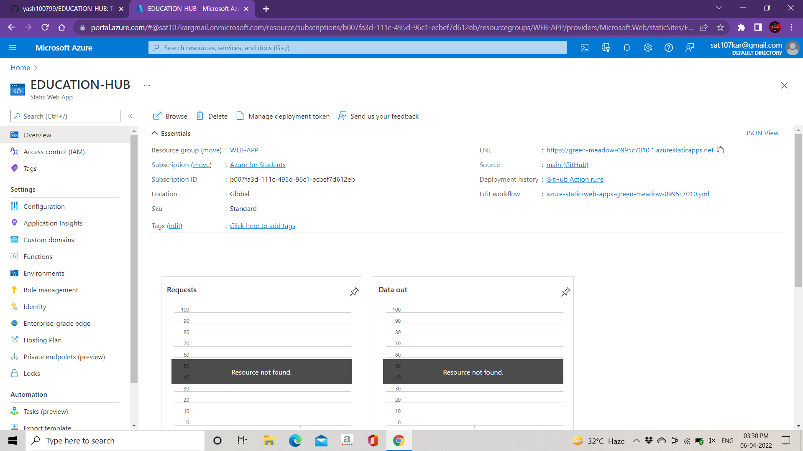
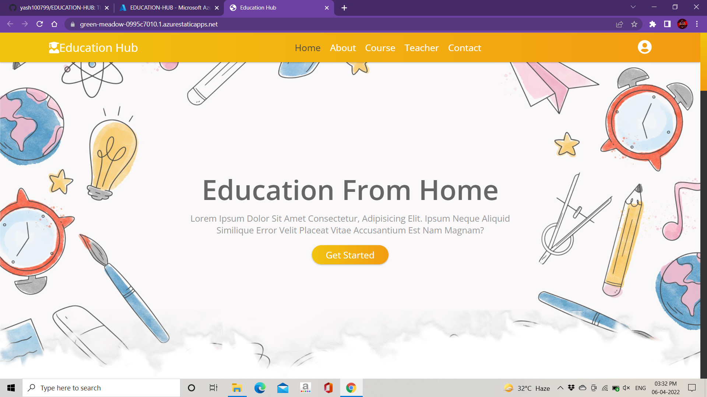
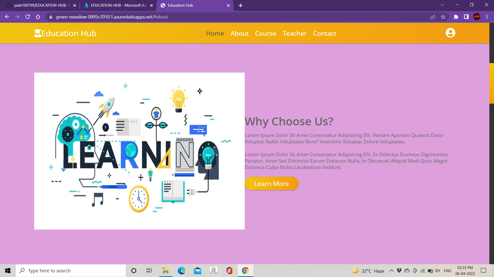
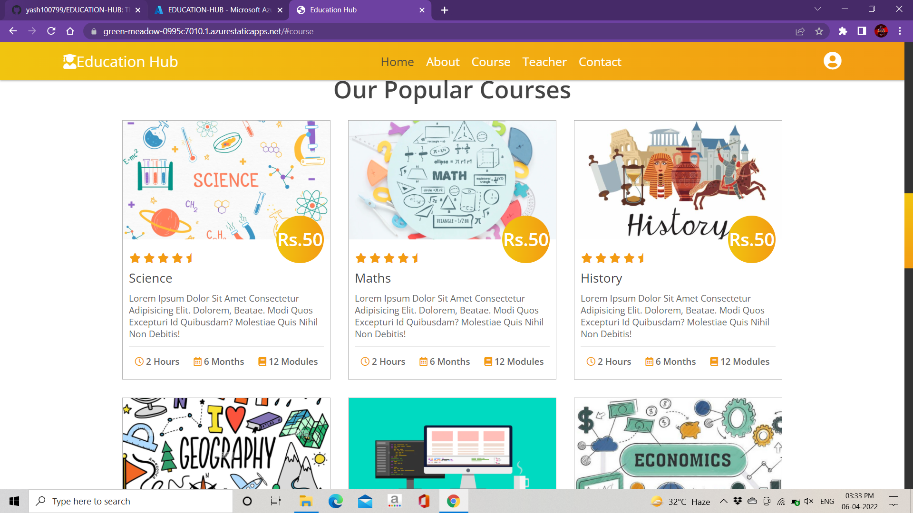
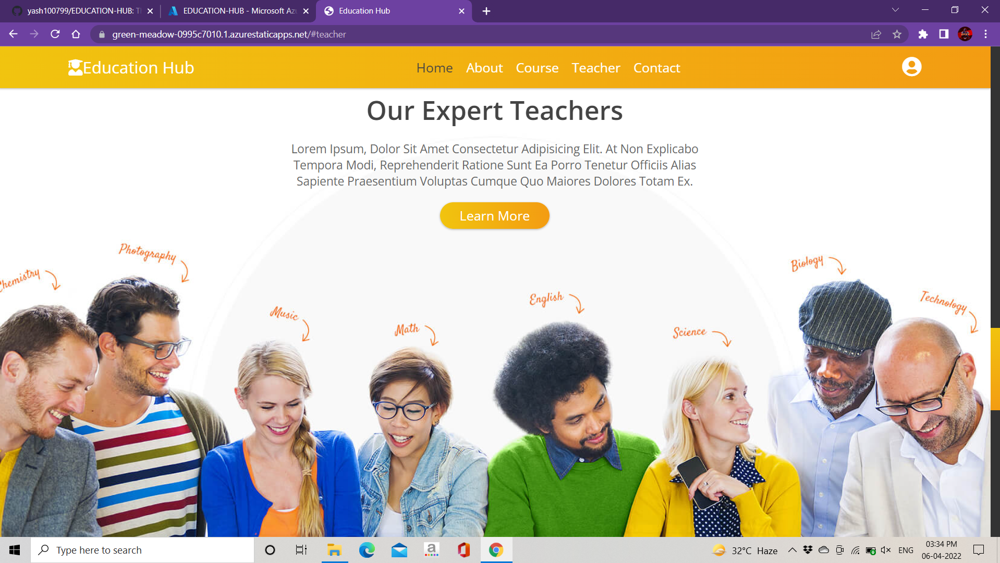
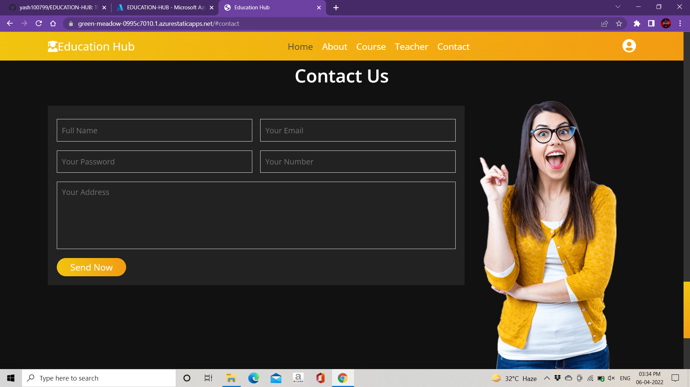
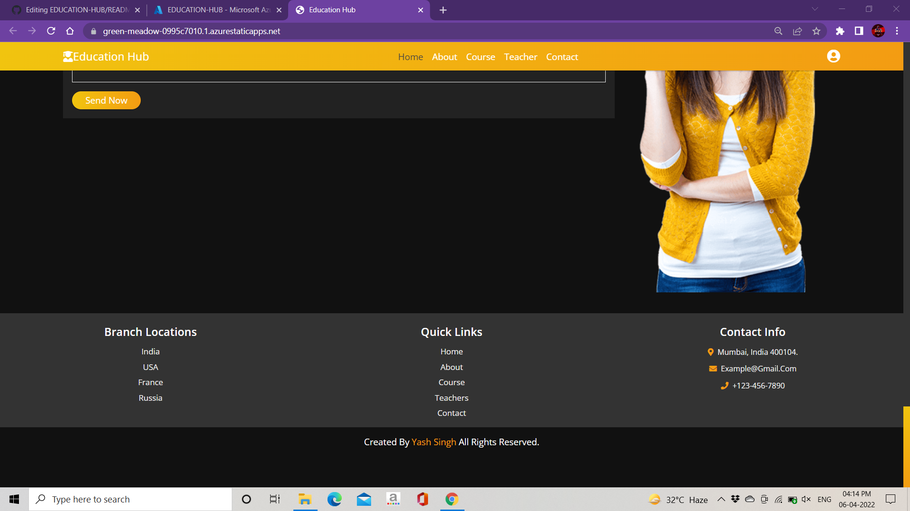

# Project For Microsoft Future Ready Talent

## EDUCATION-HUB :sparkles:
**Problem Statement**:*To build a responsive e-learning platform for students to learn various subjects and courses around the globe.*
**About the Website:-**
**EDUCATION-HUB** *is a responsive e-learning web app which will help students to learn from different part of the world without travelling long distance, 
also it will save infrastructure cost since students can learn various courses using their devices at home.
EDUCATION-HUB website provides multi platform support with proper implementation of animations and css flexbox properties which will be attractive 
and easy to use for students.
Website is deployed on Microsoft Azure using Static Web App*

**Technology and Software used:-**
1.HTML  
2.CSS&nbsp  
3.JAVASCRIPT  
3.VISUAL STUDIO CODE  
4.GOOGLE CHROME  

**Implementation Screenshots:-**
## Azure-Deployment

## Website Homepage

## About

## Course

## Teacher

## Contact

